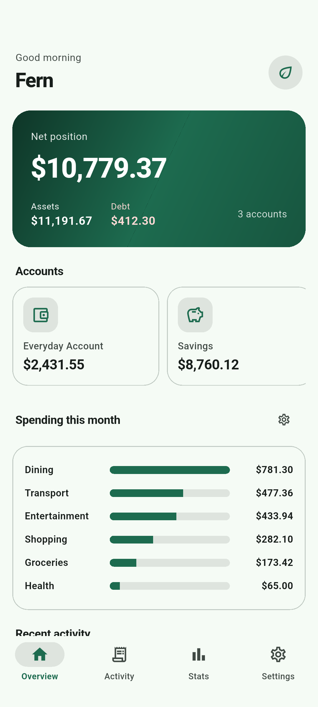
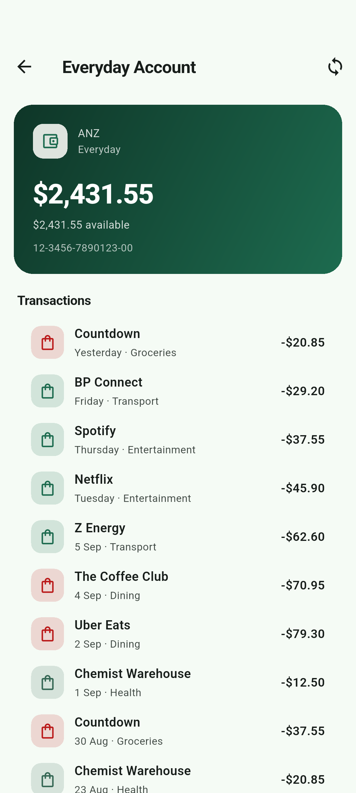
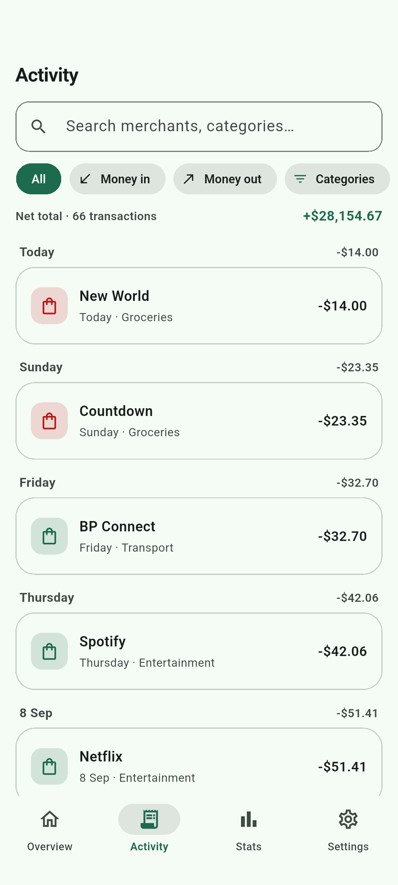
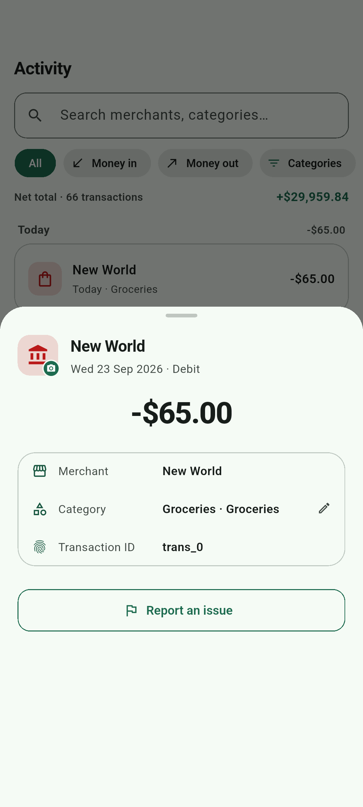
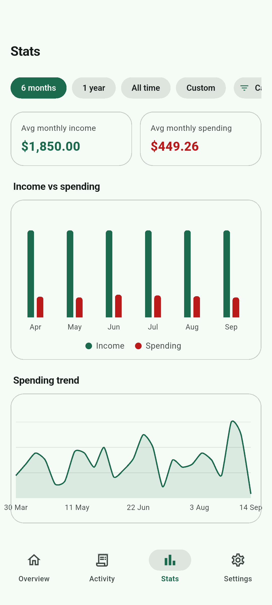
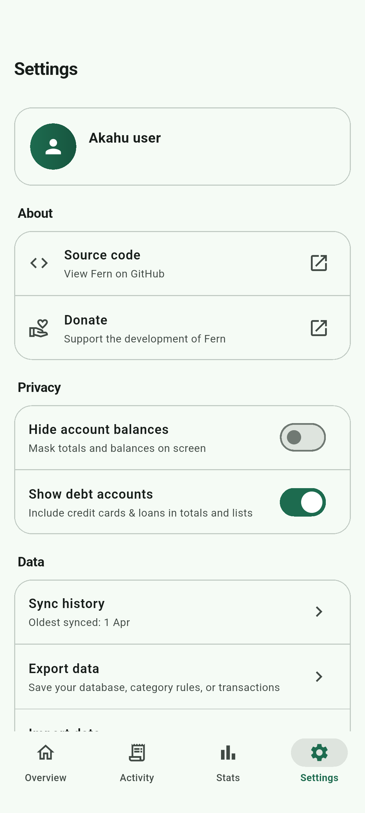

# Fern

A beautiful personal-finance app for New Zealand banks, built with
[Flutter](https://flutter.dev) on the [Akahu Enduring API](https://www.akahu.nz).
Fern connects to your bank accounts through Akahu and gives you a full
dashboard: balances, net position, spending breakdowns, searchable
transaction history, and more.

<p align="center">
  <a href="https://github.com/brandonp2412/fern/releases/latest/download/fern.apk">
    
  </a>
</p>

<p align="center">
  
  
  
  
  
  
</p>

## The Akahu API spec

The OpenAPI 3.1 spec this app is built against lives in
[`akahu-openapi.json`](./akahu-openapi.json) at the repo root — see
[developers.akahu.nz](https://developers.akahu.nz) for the human-readable docs.

## Authentication

Fern uses Akahu's user-token auth style only:

| Style      | Header                                            | Used for |
|------------|---------------------------------------------------|----------|
| User token | `Authorization: Bearer <user_token>` + `X-Akahu-Id: <app_token>` | All user-data endpoints (accounts, transactions, …) |

Get your tokens from [my.akahu.nz](https://my.akahu.nz) → Developers.

Akahu's app-auth style (`Authorization: Basic base64(app_token:app_secret)`)
is **not available to Personal Apps** at all, and several user-token
endpoints (parties, name verification, verification tokens) return 403 for
personal accounts too. Fern only implements the endpoints that actually
work on a Personal App.

## Running the app

```
flutter pub get
flutter run
```

Tokens are entered on the connect screen and stored locally with
`shared_preferences`, so you only sign in once per device.

Note: the Akahu API does not send CORS headers, so Flutter **web** builds
can't call it from a browser — use Android, iOS, or desktop targets.

## End-to-end tests

`test/integration_test.dart` runs against the live Akahu API using real
credentials from the environment:

```
source ~/.zprofile   # provides AKAHU_ACCESS_TOKEN & AKAHU_APP_ID_TOKEN
dart test test/integration_test.dart
```

- A `model parsing` group validates JSON → model mapping offline.

## Contributing

See [CONTRIBUTING.md](CONTRIBUTING.md).

## License

MIT — see [LICENSE](LICENSE).
